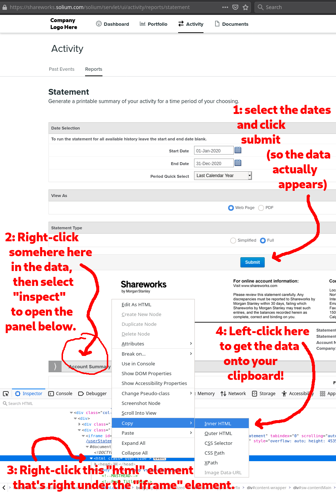

A program to Munge Shareworks reports into Something Usable
===========================================================

"Shareworks" is a product of Morgan Stanley which tracks certain kinds of financial information
(specifically, stock and compentation-related information) and distributes reports about it to the receiptients.

Inscruitably, it offers this in two formats: a PDF, and an HTML page.
Both of them have tables in a format that will make your accountant absolutely scream -- they're not in rows; there'd be a ton of manual data re-entry; it's just no good.
There is no CSV export, or anything you'd expect.

This is a program that takes the HTML form, parses it, puts it into a sane columnar layout,
and **emits the data in CSV**.

That's it.

You can then open the CSV in Excel, or LibreOffice, or whatever you please.

What the Fuck?
--------------

We're talking about the data exports from a piece of software that's A) by a major financial company, and B) *literally* has no purpose except data reporting...

and I'm telling you that their exports are too batshit for an accountant to actually use?

Yes.  Yes I am.

I cannot begin to speculate on what kind of failure of organization inside Morgan Stanley caused them to utterly fail to be able to do something like "emit a CSV report", but fail they did.

This is not software that should've needed to be written.

None the less, it was needed; and so I have written it.

License
-------

While I do hope you are not in the position of needing this, if you do, it is a free and open license.

More specifically: Apache2 or MIT licensed, at your option.

I really don't care what you do with it; I just want to increase the amount of sanity in the world, and this is a contribution.

How to Use
----------

### Requirements

1. You still have to log into the Shareworks website manually, and navigate to the reports, and save that webpage from your browser.
2. You'll need Git and a Golang compiler installed and some basic familiarity with working in the terminal.  (I couldn't be arsed to package this any better.  Sorry.)

In other words, this will require you to be somewhat technical, still.

If you'd like to make this more automated and easier to use, "PRs welcome", as we say in the tech industry.

### Steps

#### Getting the raw data

1. Log in to Shareworks and get the html file.
	- Log in to Shareworks.
	- Click "Activity" at the top.
	- Click "Reports".
	- Do the date selection to whatever you want.
	- Leave the other options as "Web Page" and "Full".
	- Submit.
	- *Save the page*.
		- ~`Ctrl-S` usually does this; your browser may vary.~
		- ~We only need the html file.  (So if the save dialog window says "web page complete" or something, and you can change that to "html only", go for it.)~
		- ~You can name it whatever you want.~
		- HANG ON.  IT GETS MORE DERANGED
	- You can't actually save the page.  Somehow this just gives you some html relating to login and a bunch of javascript.  Okay.  Buckle up.  We're going to have to grab the html out of the object inspector.  We're in web debug town now!
2. Get the actual html content.
	- (I'm splitting this into a separate step because this is getting more involved than it should be.)
	- Right-click anywhere on the page, and open "inspect".
	- Some crazy debugger thing just opened.  If you don't know what this is, don't worry, just hang on.
	- Scroll up to the top of that thing.  You should see a bit that says `<html` somewhere.  Right click on that.
	- Hover "Copy" in the right-click menu, then click "Inner HTML" -- or "Copy element" in Chrome.  (Whatever.)  You should now have a big hunk of juicy data on your clipboard.
	- Dizzy?  See the screenshot below.
	- FIXME: FIXME: FIXME: just kidding, this doesn't actually work either -- there's an iframe in the way.  You have to find that, as a human, and get the content of _that_.  Why must this be so complicated??  Who wrote this website like this and why???
3. Paste that stuff into a file.  Call it `wow.html` or whatever you want.
	- If you're not very tech savvy -- mind that this needs to be a "plain text" file.  Not a word document or whatever.  If that's not familar to you, I'm sorry; this is beyond my depth to explain in this readme.
4. HOORAY -- you are done with the browser now.  You can close it.

Here's a screenshot of what getting the raw HTML looks like:

Okay.  Phew.  Now on to actually running the munger.

#### Using the Munger

1. Git clone this repo, if you haven't already.
	- If you're not the kind of tech savvy for this -- I'm sorry; this is beyond my depth to explain in this readme.
2. You should have Golang installed.  Sanitycheck: you can run `go env` in the terminal, and it works, right?
	- If you're not the kind of tech savvy for this -- I'm sorry; this is beyond my depth to explain in this readme.
3. `go run ./main.go ./wow.html` -- or use whatever your filename was from step 3 above, when you got the data.
4. That's it!  The CSV data should've appeared on your terminal!
5. Redirect it to a file to save it: `go run ./main.go ./wow.html > sane.csv`

You should now be able to open `sane.csv` with Excel, or LibreOffice, or whatever you want!
And you can go ahead and send it to your accountant; they won't hate you anymore.
(Probably.  At least not for this issue.)
